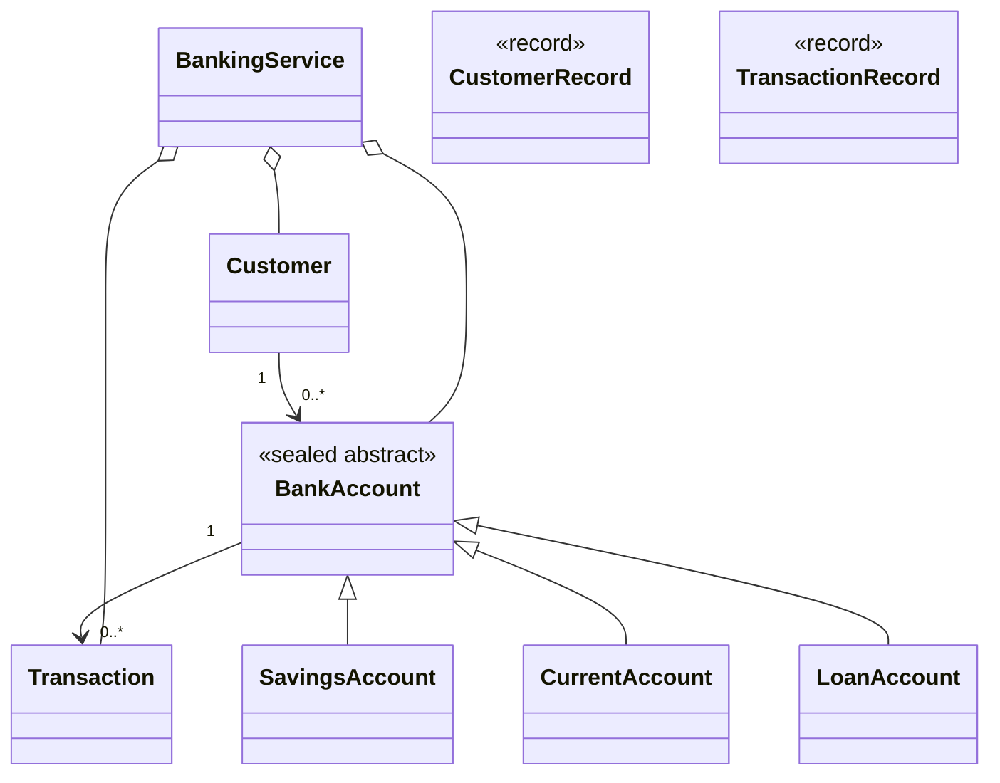

# UML Class Diagram

```mermaid
classDiagram
Customer "1" --> "0..*" BankAccount
BankAccount "1" --> "0..*" Transaction
BankAccount <|-- SavingsAccount
BankAccount <|-- CurrentAccount
BankAccount <|-- LoanAccount
BankingService o-- Customer
BankingService o-- BankAccount
BankingService o-- Transaction
class BankAccount { <<sealed abstract>> }
class CustomerRecord { <<record>> }
class TransactionRecord { <<record>> }
```
